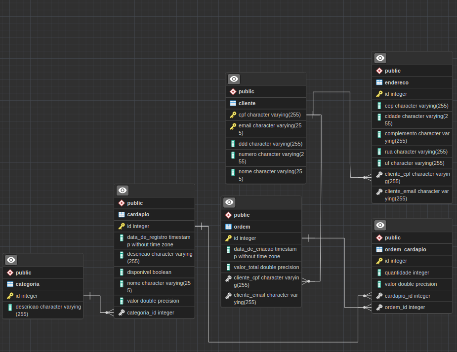

<h1 style="color: #922224" align="center">Rasfood</h1>

This project was completed during a 12-hour course on the Brazilian certified Rasmoo platform. During the course, I learned about various subjects, including:

• Hibernate annotations in general 
• How to manage OneToMany/ManyToMany relationships and their respective SQL cascades 
• Some advanced dynamic JPQL queries 
• The states of entities (transient, managed, and detached) and their respective errors. 
• How to configure databases when using Hibernate only (through an XML document). 

